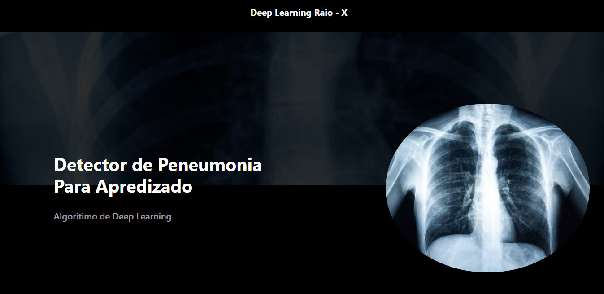
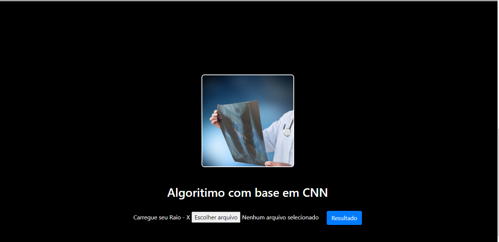

## webapp-pneumonia-cnn
- WebApp de detecção de Pneumonia utilizando algoritmos de Convolutional Neural network (CNN)

## ✨ Tecnologias

- [x] Flask
- [x] Tensorflow

<h2>Home</h2>

<h2>Predict<h2>

